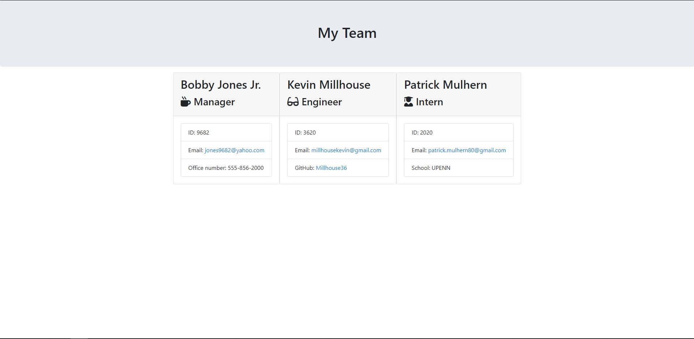
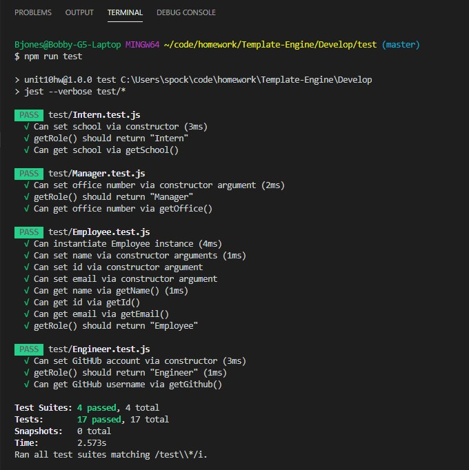

[](https://github.com/jones9682/Template-Engine)
[](https://github.com/jones9682/Template-Engine)
[](https://github.com/jones9682/Template-Engine)

# **Good README Generator**

## Description

```
As a manager
I want to generate a webpage that displays my team's basic info
so that I have quick access to emails and GitHub profiles
```

The application will prompt the user for information about the team manager and then information about the team members. The user can input any number of team members, and they may be a mix of engineers and interns. This assignment must also pass all unit tests. When the user has completed building the team, the application will create an HTML file that displays a nicely formatted team roster based on the information provided by the user. Following the [common templates for user stories](https://en.wikipedia.org/wiki/User_story#Common_templates), we can frame this challenge as follows:

## Table of- Contents
- [Questions](#Questions)
- [Description](#Description)
- [License](#License)
- [Demo](#Demo)
- [Test](#Test)
- [Repository Link](#Repository)
- [Contributors](#Contributors) 

## Demo


* Below is a sample of what the application looks like when generated.



## Test Suite: Pass



## License

[](http://doge.mit-license.org)

## Contributors
``
Bobby Jones Jr.
``
## Repository

- [Project Repo](https://github.com/jones9682/Template-Engine)

## Questions


If you have any questions about the repo, open an issue or contact me directly at jones9682@yahoo.com. You can find more of my work at my [GitHub Profile](https://github.com/jones9682).
  
  